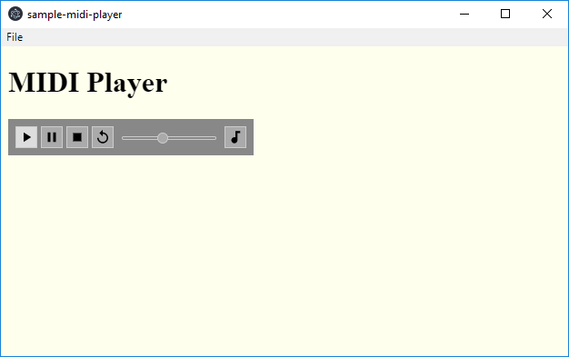

# Sample JZZ MIDI Player project for Electron

WORK IN PROGRESS

### Install
    npm install

### Run
    electron .

### Code
    // index.html
    // ...
    var JZZ = require('jzz');
    require('jazz-midi-electron')().then(function () {
      // Start JZZ after jazz-midi-electron is initialized
      JZZ()//... do whatever else ...
    });

The sound quality may be better if you connect a **MIDI instrument** to your computer
AND/OR install the [**Jazz-Plugin**](https://jazz-soft.net).

*Back to [**jazz-midi-electron**](https://github.com/jazz-soft/jazz-midi-electron).*
