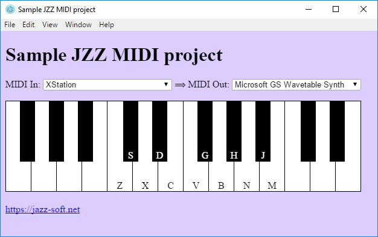

# Sample JZZ MIDI project for Electron

### Install
    npm install

### Run
    electron .

Listboxes will show more options
if you connect a **MIDI instrument** to your computer
AND/OR install the [**Jazz-Plugin**](https://jazz-soft.net).
